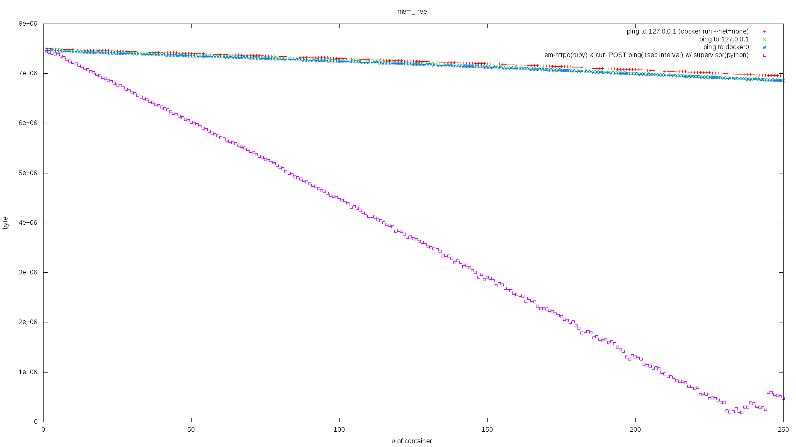
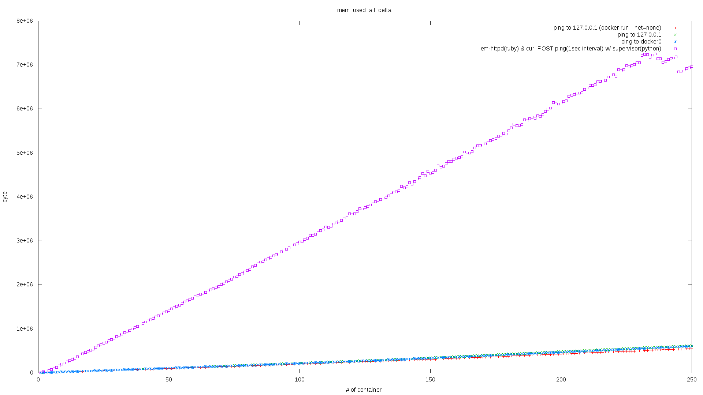
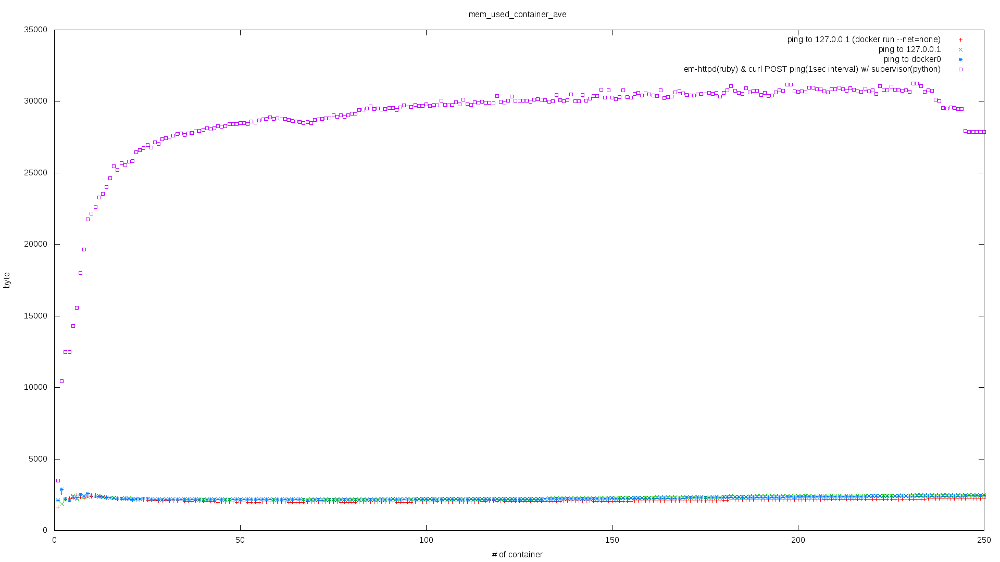
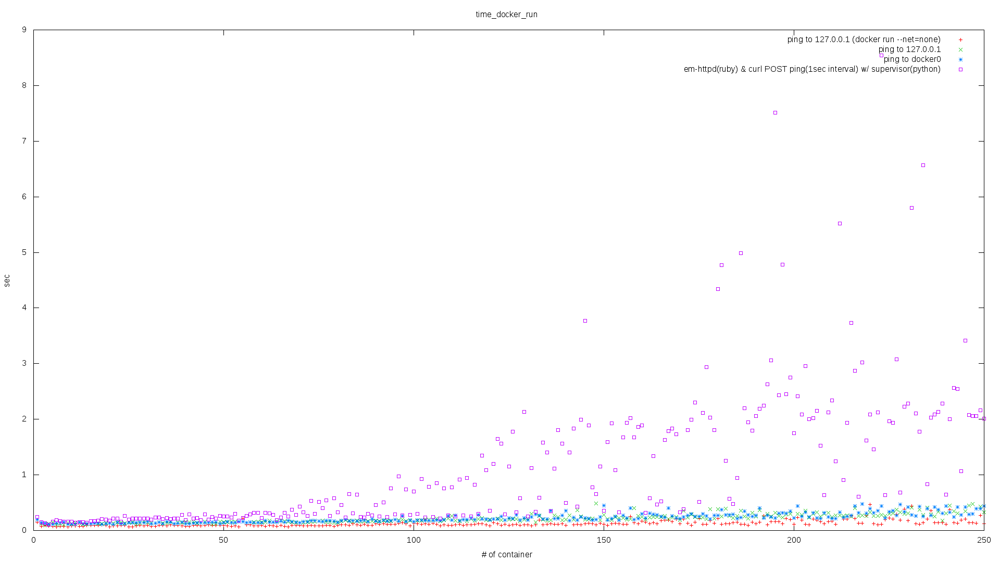

docker_bench
==========

### 概要
* 本プログラムは docker.io の性能特性を確認するためのプログラムです
  * docker.io の性能に影響を及ぼす要因のうち、支配的なものを洗い出すことが目的です
  * ひいては docker コンテナを用いたシステム設計（特にリソースプランニング）に際して考慮すべき要素を特定することが目的です
* 本プログラムの実行環境として専用の VM を用意することをおすすめします
  * 本プログラムの実行には `sudo` を no password で実行できるユーザーが必要です
  * 本プログラムを実行すると駆動中の **全コンテナ** (`docker ps`)を停止(`docker kill`)します
    * 本プログラムが起動した以外のコンテナも含みます
  * 本プログラムを実行すると停止中も含めた **全コンテナ** (`docker ps -a`)を削除(`docker rm`) します
    * 本プログラムが作成した以外のコンテナも含みます
* Ubuntu 14.04 で動作確認をしています

### 計測シナリオ

* 変動させる値
  * 同時に駆動するコンテナの数
  * 駆動するコンテナの内容

* 計測する値
  * システム全体の free なメモリ量
  * `docker run` コマンドの `time` 値

### 出力

* 以下のような4種類のグラフを出力します

|ファイル名|y軸|x軸|plot種|
|:--|:--|:--|:--|
|mem_free.png|システム全体の free なメモリ量|同時に駆動するコンテナの数|駆動するコンテナの内容<br>（4種類-詳細後述）|
|mem_used_all_delta.png|メモリ使用量の変化量<br>（計測開始前の free なメモリ量 - 現在の free なメモリ用）|同上|同上|
|mem_used_container_ave.png|1コンテナあたりを維持するために必要なメモリ量<br>（メモリ使用量の変化量 / 同時に駆動するコンテナの数）|同上|同上|
|time_docker_run.png|コンテナの起動にかかった時間(※1)|同上|同上

(※1) `docker run` にかかった `time` 値であり、コンテナがサービスとして ready 状態になったタイミングを示すものではない点に注意。<br>
ここはいずれ改善したい部分。<br>
「ready 状態」をどのように定義するかによって計測の仕方は変わる。<br>
計測方法の例としては、コンテナに ready になると同時に STDOUT に何らかのキーワードを出力するよう手を加えておき、外部から `docker logs` で polling 観測する方法が比較的簡単。
一方で、コンテナ数が増えた際に `docker` コマンド自体が非常に遅くなることから、ready 検知の時間が（ `docker logs` コマンドの遅延分が加算され）実際より長く誤観測される可能性は高い。

### 出力サンプル

* `mem_free.png`


* `mem_used_all_delta.png`


* `mem_used_container_ave.png`


* `time_docker_run.png`


### 動作要件 (※2)
* 必要となるテスト用ユーザー
  * no password で `sudo` を実行できるユーザー
* 必要となるコマンド&ライブラリ
  * sudo
  * service
  * vmstat
  * mpstat
  * docker
  * jq
  * gnuplot
  * ruby
   * awesome_print gem
   * sqlite3 gem

(※2) Ubuntu でのインストール手順を後述しているので参照の程

### 使い方
1. テスト実行スクリプトを起動
  * `docker_bench/bin/run_test.sh`

1. 以下のファイルを確認する
  * `docker_bench/out/last/*.png`

### 詳細なログ
* `docker_bench/out/last/<sub_test_name>/`
  * `result.log` ... テスト実行時の STDOUT
  * `result.csv` ... STDOUT をパースして各値を CSV 化したもの
  * `result.sqlite3` ... STDOUT をパースして各値を SQLite3 フォーマットで DB 化したもの
  * `result__<col_name>.csv` ... `result.csv` の特定の列のみを抜き出したもの
  * `result__<col_name>_plot.dat` ... `gnuplot` 用に特定の列のみを抜き出したもの
  * `result__<col_name>_plot.png` ... `result__<col_name>_plot.dat` をグラフ化したもの

### カスタマイズ
* テストは各サブテストに分割されている
* サブテストを順に実行した後、サブテスト横断のグラフを作成している

#### 各サブテストの内容をカスタマイズする場合
* テスト向けの各種変数が記載されている `docker_bench/tests/<sub_test_dir>/vars.sh` を編集する
* 各変数の意味は以下の通り
  * `CONTAINER_NAME`
    * 実行するコンテナのコンテナイメージ名
    * 必須
  * `CONTAINER_COUNT`
    * 同時実行させるコンテナの最大数
    * 後述の方法により上書きされうる
    * 任意(省略時は `100`)
  * `DOCKER_RUN_PARAMS`
    * `docker run` 時に付与するパラメータ(`-d` オプションを含めることを推奨)
    * 任意(省略時は `-d`)
  * `TEST_DESCRIPTION`
    * グラフ化したときに plot 種として表記される内容
    * 任意(省略時は `<sub_test_dir>`)
* 新しいコンテナイメージを追加したい場合は `docker_bench/containers/<container_dir>/` 配下に Dockerfile を作成するとよい
  * テストの pre-process として `docker build` される
  * build されるコンテナイメージのタグは `<container_dir>` になる

#### サブテストを追加する場合
* `docker_bench/tests/` 配下に任意の名前でディレクトリを作成し `vars.sh` を配置する
  * `vars.sh` の記載方法は前述参照
  * `CONTAINER_NAME` 変数は必須なので留意すること

#### 各サブテストを個別に実行する場合
* `docker_bench/bin/run_test.sh` の引数に `<sub_test_dir>` を指定する
  * 例: `$ ./bin/run_test.sh tests/test1`

#### 同時実行させるコンテナの最大数を変更する場合
* `FORCE_CONTAINER_COUNT` 環境変数を設定して `docker_bench/bin/run_test.sh` を実行する
  * 例: `$ env FORCE_CONTAINER_COUNT=10 ./bin/run_test.sh`

-----

### コンテナの内容
* コンテナとして4種類の内容を用意した
  1. test1
    * コンテナイメージ名: `ping_local`
      * `FROM ubuntu:14.04`
      * 127.0.0.1 に `ping` を実行する
    * `docker run` 時のオプションとして `--net="none"` と追加している

  1. test2
    * コンテナイメージ名: `ping_local`
      * `FROM ubuntu:14.04`
      * 127.0.0.1 に `ping` を実行する

  1. test3
    * コンテナイメージ名: `ping_docker`
      * `FROM ubuntu:14.04`
      * docker host のインターフェイス(docker0: 172.17.42.1 決め打ち) に ping を実行する

  1. test4
    * コンテナイメージ名: `em-httpd`
      * `FROM ubuntu:14.04`
      * `supervisor`(※3) で以下の子プロセスを並列実行する
        * `em-httpd.rb`(HTTP POST を受け付け、内容を STDOUT に出力する ruby script）
        * `curl-ping.sh`(1秒間隔で 127.0.0.1 に `curl` を用いて HTTP POST を送信する bash script)
        * `sshd` (※4)
    * python, ruby, bash の各スクリプトが駆動することもあり、メモリ使用量は多め
      * 当該コンテナの起動直後の VSZ/RSS は 46,184/10,096 byte 程

(※3) [supervisor](http://supervisord.org/) python 製プロセス管理ツール。
ここでは、同一コンテナ中で複数の子プロセスを駆動させるために使っている。

(※4) sshd はコンテナの動作を確認するために用意している。
ユーザー名 `docker` で `docker_bench/containers/test4/id_rsa` を用いてログインできる。
IP address は `docker inspect` を用いて調査すること。
`docker_bench/containers/test4/ssh.sh` を用いて、最後に起動したコンテナにログインできる。

### Ubuntu でのテスト環境構築手順

```
## テスト用の user を no password で sudo 可能にする
$ sudo "${test_user_name} ALL=(ALL) NOPASSWD: ALL" > /etc/sudoers.d/${test_user_name}
$ sudo chmod 400 /etc/sudoers.d/${test_user_name}

## 必要となるソフトウェア&ライブラリをインストール
$ sudo apt-get -y install \
    sysstat \
    ruby \
    ruby-dev \
    make \
    sqlite \
    libsqlite3-dev \
    jq \
    gnuplot

$ sudo gem install bundler # オプショナル
$ sudo gem install awesome_print
$ sudo gem install sqlite3

### docker.io のインストール
$ curl -sSL https://get.docker.io/ubuntu/ | sudo sh
### テスト用 user に docker.io を操作可能にする
$ sudo usermod -a -G docker ${test_user_name}

### 本プログラムのセットアップ
$ git clone ${this_repo_url}
$ cd docker_bench

### テスト用ユーザーで操作している場合は relogin すること
```
